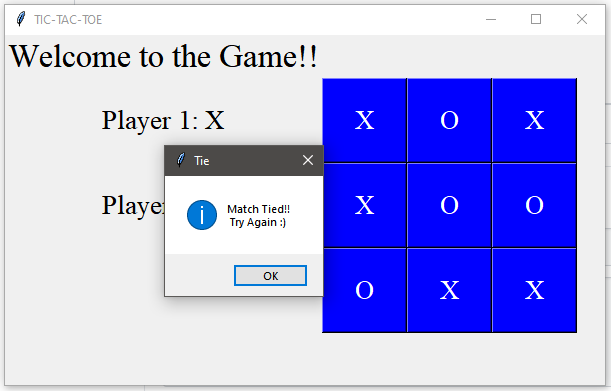

# Basic Tic-Tac-Toe

## Features
This application is Tic Tac Toe game using Python Tkinter, where player 1 is X who begins the game while player 2 is O

## To Run
python tictactoe.py

## Screenshot 

